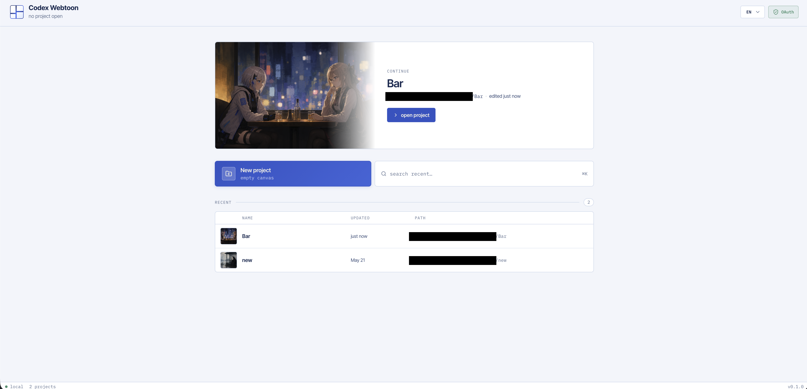

<p align="center">
  
</p>

<h1 align="center">codex-webtoon</h1>

<p align="center">
  <a href="https://www.npmjs.com/package/codex-webtoon">
    
  </a>
  
</p>

<p align="center">
  Local-first AI webtoon studio powered by Codex CLI OAuth.
</p>

<p align="center">
  <strong>EN</strong> · <a href="./README.kr.md">KR</a>
</p>

<p align="center">
  
</p>

> Unofficial project. codex-webtoon is not affiliated with, endorsed by, or
> sponsored by OpenAI.
>
> `openai-oauth` is a third-party OAuth proxy. It is not an official OpenAI
> product, SDK, API endpoint, or supported OpenAI API path. It is licensed
> AGPL-3.0-only; see [Third-party notices](./docs/third-party-notices.md).

codex-webtoon is a local-first studio for building vertical webtoon drafts. It
keeps project files, generated image candidates, and exports on your machine.
Image generation itself is not offline: the common prompt, selected panel
prompt, and any selected reference image data are sent through the local
third-party `openai-oauth` proxy as an external model request.

## Quick Start

Requirements:

- Node.js 22 or newer
- npm, included with Node.js

Install and run:

```bash
npm install -g codex-webtoon
codex-webtoon setup
codex-webtoon serve
```

Open <http://127.0.0.1:4321/> after the server starts.

Available commands:

```bash
codex-webtoon setup
codex-webtoon serve
codex-webtoon status
codex-webtoon help
```

## Screenshots

<p align="center">
  
</p>

## Example

<p align="center">
  
</p>

This sample page was assembled in codex-webtoon from generated panel candidates
and editable speech bubble layers.

## Features

- Vertical webtoon canvas with selectable panels
- Add, duplicate, delete, reorder, and resize panels
- Project-level common prompt and panel-level scene prompt
- Selected-panel generation with candidate history
- Editable speech, monologue, thought, and SFX layers
- Local JSON export and full-strip PNG export

## Documentation

- [Architecture](./docs/architecture.md)
- [Third-party notices](./docs/third-party-notices.md)
- [Web UI](./docs/web-ui.md)

## License

codex-webtoon is distributed under the MIT License. See [LICENSE](./LICENSE).
The bundled `openai-oauth` runtime dependency is third-party and licensed
AGPL-3.0-only; see [Third-party notices](./docs/third-party-notices.md).

## Authentication

Image generation uses a local Codex OAuth proxy process. `setup` runs the
packaged Codex CLI login flow and writes local config under the config
directory:

```bash
codex-webtoon setup
```

After setup, `serve` starts the local web server and launches the packaged
third-party `openai-oauth` proxy when a Codex OAuth session is available. The
proxy receives generation prompts and selected reference image data on
localhost, then forwards the generation request to external model services.

## Environment

| Variable | Default | Description |
| --- | --- | --- |
| `CODEX_WEBTOON_HOST` | `127.0.0.1` | Local server host. |
| `CODEX_WEBTOON_PORT` | `4321` | Local server port. |
| `CODEX_WEBTOON_CONFIG_DIR` | `~/.config/codex-webtoon` | Config and server advertisement directory. |
| config file | `~/.config/codex-webtoon/config.json` | Optional file layer written by `codex-webtoon setup`; env vars still win. |
| `CODEX_WEBTOON_PROJECTS_ROOT` | `~/WebtoonProjects` | Local project storage root. |
| `CODEX_WEBTOON_OAUTH` | `auto` | OAuth mode: `auto`, `on`, or `off`. |
| `CODEX_WEBTOON_OAUTH_PROXY_PORT` | `10531` | Local OAuth proxy port. |
| `CODEX_WEBTOON_OAUTH_STARTUP_TIMEOUT_MS` | `20000` | OAuth proxy startup timeout. |

## Development

This repo uses pnpm for development.

Use the pinned Node.js version before installing dependencies:

```bash
nvm use
```

Tools that read `.node-version` can switch to the pinned development baseline
automatically.

```bash
pnpm install
pnpm dev
```

The Vite dev server runs at <http://127.0.0.1:5173/> and the API server runs at
<http://127.0.0.1:4321/>.

## Checks

```bash
pnpm format:check
pnpm typecheck
pnpm test
pnpm build
pnpm audit --prod
```
