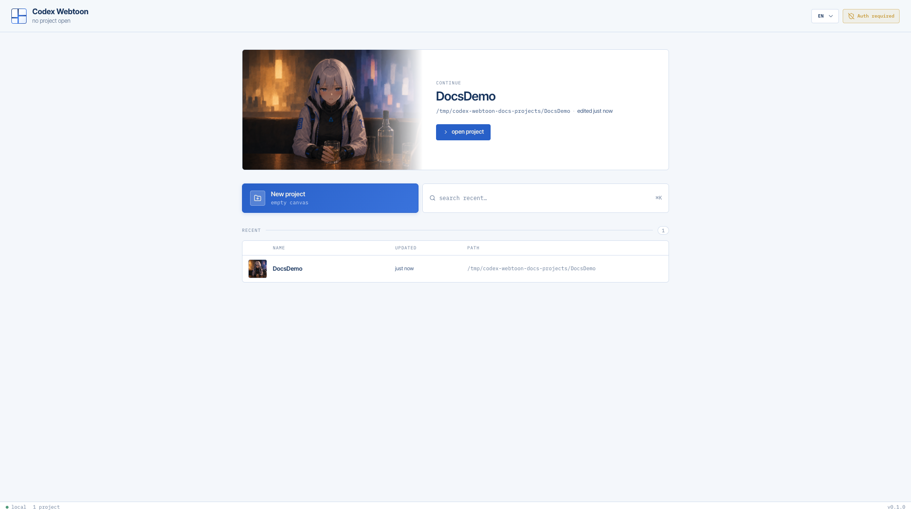
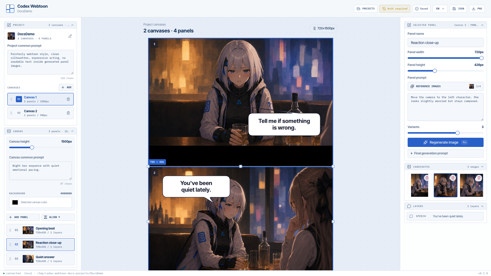
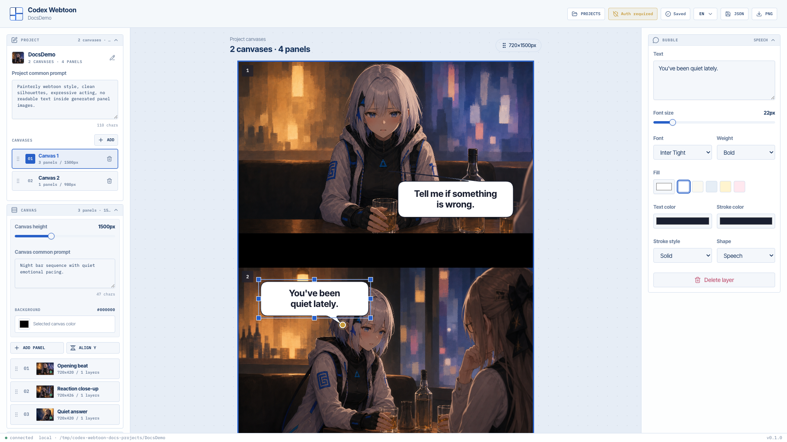
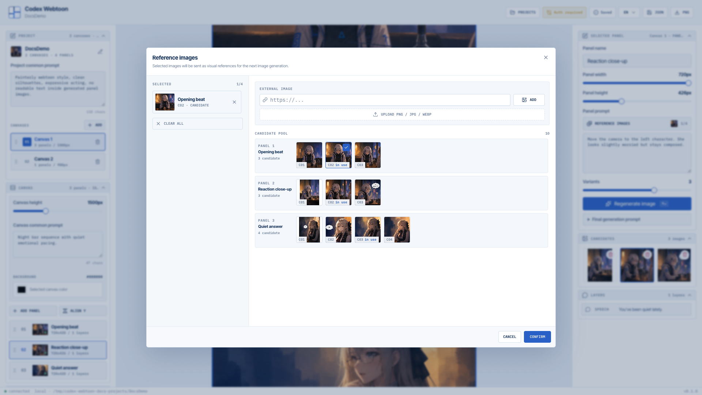
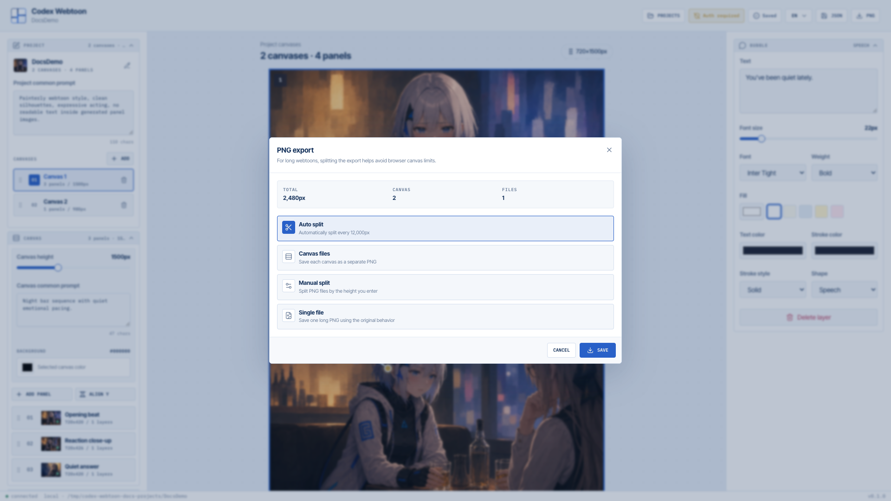

# 웹 UI

[EN](./web-ui.md) | **KR**

codex-webtoon의 웹 UI는 프로젝트 선택 화면과 스튜디오 화면으로 나뉩니다.
사용자는 프로젝트를 만들거나 열고, 스튜디오에서 패널을 편집하며, 선택한 패널의
이미지를 생성하고 후보를 관리합니다.

이 문서의 모든 스크린샷은 Playwright CLI로 1920x1080 해상도에서 촬영했습니다.

## 전체 사용자 흐름

1. `codex-webtoon serve` 실행
2. 브라우저에서 `http://127.0.0.1:4321` 접속
3. 프로젝트 선택 화면에서 새 프로젝트 생성 또는 기존 프로젝트 열기
4. 스튜디오에서 패널 선택
5. 패널 프롬프트 입력
6. 이미지 생성
7. 후보 이미지 선택/삭제
8. 말풍선 레이어 편집
9. JSON 또는 PNG 내보내기

## 프로젝트 선택 화면

프로젝트 선택 화면은 `src/components/project-picker/*`가 담당합니다.

주요 요소:

- 상단 앱 헤더
- 언어 선택
- OAuth 상태 badge
- 최근 프로젝트 hero
- 새 프로젝트 버튼
- 최근 프로젝트 검색
- 프로젝트 목록
- 프로젝트 생성 모달

새 프로젝트를 만들면 서버의 `POST /api/projects`로 프로젝트 폴더와 metadata를
생성합니다. 프로젝트를 열면 `ProjectShell`이 상태 JSON을 로드하고, 없으면 기본
스튜디오 상태를 생성합니다.

## 스튜디오 화면

스튜디오는 `src/components/studio/*` 아래에 있으며, 크게 네 영역으로 구성됩니다.

| 영역         | 역할                                                          |
| ------------ | ------------------------------------------------------------- |
| Header       | 프로젝트 이동, OAuth 상태, 저장 상태, 언어, JSON/PNG 내보내기 |
| Left Sidebar | 프로젝트/캔버스/패널/말풍선 도구/히스토리                     |
| Canvas Stage | 웹툰 캔버스와 패널을 직접 선택/변형하는 작업 영역             |
| Inspector    | 선택된 패널 또는 말풍선의 세부 설정                           |

## Header

Header는 `src/components/studio/header/*`가 담당합니다.

주요 기능:

- 프로젝트 목록으로 돌아가기
- OAuth 상태 표시
- 저장 상태 표시
- 언어 전환
- JSON 내보내기
- PNG 내보내기

PNG 내보내기는 전체 웹툰 스트립, 자동 분할, 캔버스별 저장 옵션을 제공합니다.
긴 웹툰은 브라우저 canvas 한계를 피하기 위해 분할 내보내기를 사용할 수 있습니다.

## Left Sidebar

Sidebar는 프로젝트 구조를 빠르게 조작하는 영역입니다.

### 프로젝트 섹션

- 프로젝트 이름과 metadata 표시
- 프로젝트 이름 변경
- 프로젝트 공용 프롬프트 입력

### 캔버스 섹션

- 캔버스 목록
- 캔버스 추가/삭제/재정렬
- 캔버스 높이 조절
- 캔버스 공용 프롬프트
- 캔버스 배경색

### 패널 목록

- 선택된 캔버스의 패널 목록 표시
- 패널 추가
- 패널 자동 Y 정렬
- 패널 선택
- 패널 재정렬
- 패널 삭제

### 말풍선 도구

선택된 패널에 레이어를 추가합니다.

- 대사
- 타원
- 구름
- 강조
- 박스
- 생각
- 효과음

### 히스토리

편집 히스토리와 undo 가능 상태를 표시합니다.

## Canvas Stage

Canvas Stage는 실제 웹툰 캔버스를 보여주는 중앙 작업 영역입니다.

특징:

- 기본 패널 폭은 720px입니다.
- 여러 캔버스를 세로 스택으로 표시합니다.
- 패널은 선택, 이동, 크기 조절이 가능합니다.
- 생성 중인 패널에는 loading overlay가 표시됩니다.
- 생성 후보가 선택되면 패널 배경 이미지로 렌더링됩니다.
- 말풍선 레이어는 패널 이미지 위에 별도 레이어로 표시됩니다.

선택 상태는 단일 선택과 다중 선택을 모두 지원합니다. 패널과 말풍선은 각각 별도
선택 상태를 가집니다.

## Inspector

Inspector는 오른쪽 패널이며, 현재 선택 대상에 따라 다른 폼을 보여줍니다.

### 패널 선택 시

`PanelForm`, `CandidateGrid`, `LayerSection`이 표시됩니다.

패널 폼:

- 패널 이름
- 패널 너비
- 패널 높이
- 레퍼런스 이미지
- 컷별 프롬프트
- 변형 수
- 이미지 생성/재생성
- 최종 생성 조건 확인

후보 영역:

- 생성 후보 목록
- 선택된 후보 표시
- 후보 삭제

레이어 영역:

- 패널에 포함된 말풍선/효과음 레이어 목록
- 레이어 선택 및 삭제

### 말풍선 선택 시

`BubbleForm`이 표시됩니다.

주요 설정:

- 텍스트
- 글자 크기
- 글꼴
- 굵기
- 채우기 색
- 글자색
- 선 색
- 선 스타일
- 말풍선 모양

## 이미지 생성 UI 흐름

이미지 생성은 선택된 패널 기준으로 동작합니다.

1. 사용자가 패널을 선택합니다.
2. Inspector에서 컷별 프롬프트를 입력합니다.
3. 필요하면 레퍼런스 이미지를 선택합니다.
4. 변형 수를 선택합니다.
5. `이미지 생성` 버튼을 누릅니다.
6. UI는 버튼을 `생성 중` 상태로 바꾸고 패널에 loading overlay를 표시합니다.
7. 서버의 `POST /api/generate`가 성공하면 candidate가 추가됩니다.
8. 첫 candidate가 자동 선택되어 패널에 렌더링됩니다.
9. 버튼 문구는 `이미지 재생성`으로 바뀝니다.

프롬프트가 비어 있으면 생성 요청을 보내지 않고 오류 메시지를 표시합니다.

## 저장

스튜디오 상태는 프로젝트 상태 JSON으로 저장됩니다.

저장 대상:

- 프로젝트 공용 프롬프트
- 캔버스 목록과 설정
- 패널 geometry와 프롬프트
- 후보 이미지 참조
- 말풍선 레이어
- 선택 상태
- 변형 수

저장 상태는 Header에 표시됩니다.

## 내보내기

### JSON

현재 프로젝트 상태를 JSON으로 다운로드합니다.

### PNG

브라우저 canvas를 사용해 웹툰 이미지를 PNG로 렌더링합니다.

지원 모드:

- 전체 스트립
- 자동 분할
- 수동 분할
- 캔버스별 저장

렌더링 순서는 패널 이미지가 아래, 말풍선 레이어가 위입니다.

## 다국어

UI는 한국어와 영어를 지원합니다.

- 리소스: `src/i18n/resources.ts`
- 초기 언어: localStorage 또는 브라우저 언어
- 언어 전환: Header의 language switcher

선택한 언어는 localStorage에 저장됩니다.

## 접근성 및 테스트 관점

주요 상호작용 요소는 button, textbox, combobox 등 기본 role을 사용합니다. 이
덕분에 Playwright CLI snapshot 기반 테스트에서 다음 흐름을 검증할 수 있습니다.

- 새 프로젝트 생성
- 패널 프롬프트 입력
- 이미지 생성 버튼 클릭
- 후보 이미지 렌더링 확인
- `/api/generate` `201 Created` 확인

macOS와 Windows native PowerShell 환경 모두에서 실제 이미지 생성까지 검증된
상태입니다.
